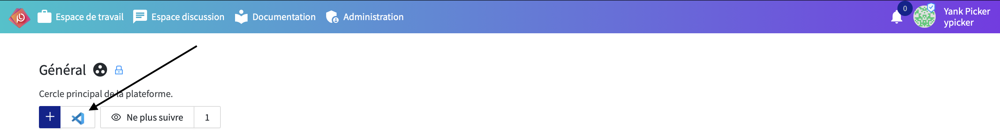

# PLaTon Editor

A Visual Studio Code extension to explorer and manage PLaTon resources and circles.

## Instalation

Launch VS Code Quick Open (`Ctrl+P` or `Cmd+P` on MacOS) , paste the following command, and press enter:

```txt
ext install PLaTon.platon-editor
```

Or you can just search for "PLaTon Editor" in the Extensions view.

## Requirements

* Git

## Usage

* Click on the Visual Studio Code icon button on PLaTon application to open a resource with the editor.



* Once opened you can use all the features of the editor.

* To sync the files on your local machine with the server, launch VS Code Quick Open (`Ctrl+P` or `Cmd+P` on MacOS) , search for the command `> PLaTon: Sync` and press enter then the extension will pull the new contents from the server and push your edits.

* At this step you may need to resolves edit conflicts on your local system.

## Extension Settings

Nothing

## Known Issues

Nothing

## Release Notes

### 0.0.1

Bêta release
